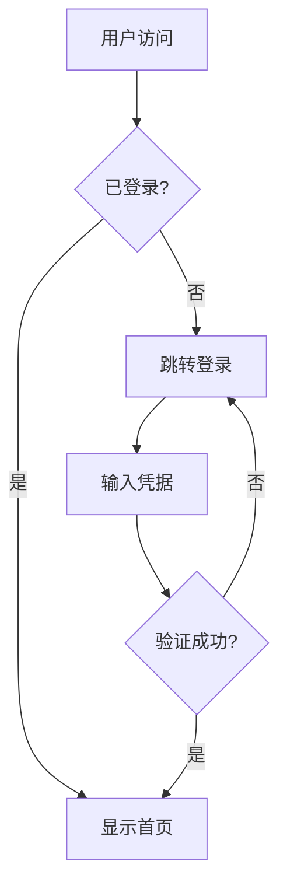

---
tags:
  - Web前端
  - 框架
  - VitePress
  - SSG
  - 文档站
date: 2026-05-14
status: 已完成
difficulty: 中等
---

# VitePress与文档站构建

## What — 是什么

> VitePress 是 Vue 团队出品的静态站点生成器（SSG），基于 Vite 构建、Markdown 驱动、Vue 组件增强，专为技术文档、组件库文档和知识库站点设计，也是 Vue.js 官方文档的构建工具。

**核心概念：**

- **Markdown 驱动**：每个 `.md` 文件即一个页面，支持 YAML Frontmatter 配置，支持在 Markdown 中直接使用 Vue 组件和语法
- **Vue 组件增强**：在 Markdown 中嵌入 Vue 组件、使用 Vue 模板语法（`v-for`、`v-if`、`{{ }}`）、引入交互式示例
- **Vite 驱动**：开发服务器毫秒级 HMR，构建产物高度优化，原生支持 TypeScript、CSS Modules、PostCSS
- **主题系统**：默认主题专为文档设计（导航、侧边栏、搜索、多语言），支持完全自定义主题
- **数据加载**：`data loaders` 在构建时获取远程或本地数据，注入到页面中使用

**核心架构：**

- 技术栈：Vite + Vue 3 + Markdown-it
- 渲染流程：Markdown + Vue SFC → Vite 编译 → SSR 生成静态 HTML → 客户端 Hydration（仅交互组件）
- 数据流：`.md` 文件 + Frontmatter → VitePress 解析 → Vue 组件渲染 → 静态 HTML + JS Bundle
- 构建优化：每个页面自动代码拆分，非交互页面 JS 体积极小

**关键特性：**

- 内置全文搜索（基于 MiniSearch）和 Algolia DocSearch 集成
- Sitemap 自动生成
- 多语言（i18n）内置支持
- last-updated 时间戳（基于 Git）
- 页面自动生成侧边栏导航

## Why — 为什么

**适用场景：**

- 开源项目文档站——Vue、Pinia、Vite、Rollup 等官方文档都用 VitePress
- 组件库文档——组件示例嵌入 Markdown，交互式演示
- 技术博客与知识库——Markdown 写作 + Vue 增强交互
- API 文档站——代码示例 + 实时预览
- 内部知识库——团队文档、设计规范、开发指南

**核心优势：Vue 生态的文档站最优解**

Vue 官方文档从 VuePress 迁移到 VitePress，原因是 VuePress 基于 Webpack，开发体验差（HMR 慢）、构建慢、配置复杂。VitePress 基于 Vite，解决了所有这些问题。同时 VitePress 的设计更简洁——不做 VuePress 那样的"通用 CMS"，而是专注做好文档站这一个场景，功能取舍更精准。

**对比同类框架：**

| 维度 | VitePress | VuePress | Astro | Docusaurus |
|------|-----------|----------|-------|------------|
| 技术栈 | Vite + Vue 3 | Webpack + Vue 2 | Vite + 多框架 | Webpack + React |
| 开发 HMR | 极快（Vite） | 慢（Webpack） | 极快（Vite） | 慢（Webpack） |
| Markdown 增强 | Vue 组件 + 语法 | Vue 组件（有限） | Astro 组件 + 岛屿 | MDX |
| 默认主题 | 文档专用（精致） | 文档专用（朴素） | 博客/文档（灵活） | 文档专用（成熟） |
| 全文搜索 | 内置 MiniSearch | 需插件 | 需集成 | 内置 |
| 多语言 i18n | 内置 | 需插件 | 需集成 | 内置 |
| 自定义主题 | Vue 组件（灵活） | Vue 组件 | Astro 组件 | React 组件 / Swizzle |
| 静态输出 | 是（SSG） | 是（SSG） | 是（SSG/SSR） | 是（SSG） |
| 适用场景 | Vue 生态文档站 | 旧项目维护 | 内容站/博客/文档 | React 生态文档站 |
| 学习曲线 | 低（Markdown + Vue 基础） | 中 | 低 | 中 |

**优缺点：**

- ✅ 优点：
  - Vite 驱动，开发和构建极快
  - Vue 组件与 Markdown 无缝融合，交互式文档的天花板
  - 默认主题专业精致，开箱即用
  - 内置全文搜索、多语言、Sitemap
  - 官方维护，与 Vue 生态深度集成
  - 配置简洁，约定大于配置
- ❌ 缺点：
  - 绑定 Vue 生态，React/Svelte 项目不够自然
  - 博客功能不如 Astro 成熟（无内置 Content Collections）
  - 社区和插件比 Docusaurus 小
  - SSR/动态内容场景需额外方案

## How — 怎么用

### 1. 项目初始化与结构

```bash
# 初始化项目
mkdir my-docs && cd my-docs
npm init -y
npm add -D vitepress vue

# 创建第一个文档
mkdir docs
echo '# Hello VitePress' > docs/index.md

# 添加脚本到 package.json
```

```json
{
  "scripts": {
    "docs:dev": "vitepress dev docs",
    "docs:build": "vitepress build docs",
    "docs:preview": "vitepress preview docs"
  }
}
```

```bash
# 启动开发服务器
npm run docs:dev
```

**推荐项目结构：**

```
my-docs/
├── docs/
│   ├── .vitepress/           # VitePress 配置目录
│   │   ├── config.mts        # 主配置文件
│   │   ├── theme/            # 自定义主题
│   │   │   ├── index.ts      # 主题入口
│   │   │   ├── custom.css    # 自定义样式
│   │   │   └── Layout.vue    # 自定义布局
│   │   └── cache/            # 构建缓存（gitignore）
│   ├── index.md              # 首页
│   ├── guide/                # 指南章节
│   │   ├── getting-started.md
│   │   ├── configuration.md
│   │   └── deployment.md
│   ├── api/                  # API 文档章节
│   │   ├── overview.md
│   │   └── reference.md
│   └── blog/                 # 博客章节
│       ├── first-post.md
│       └── second-post.md
├── package.json
└── .gitignore
```

### 2. 配置文件

```ts
// docs/.vitepress/config.mts
import { defineConfig } from 'vitepress'

export default defineConfig({
  // 站点元数据
  lang: 'zh-CN',
  title: 'My Docs',
  description: '我的文档站',

  // 主题配置
  themeConfig: {
    // 导航栏
    nav: [
      { text: '指南', link: '/guide/getting-started' },
      { text: 'API', link: '/api/overview' },
      { text: '博客', link: '/blog/first-post' },
      {
        text: '更多',
        items: [
          { text: 'GitHub', link: 'https://github.com/user/repo' },
          { text: 'Changelog', link: '/changelog' },
        ],
      },
    ],

    // 侧边栏
    sidebar: {
      '/guide/': [
        {
          text: '入门',
          items: [
            { text: '快速开始', link: '/guide/getting-started' },
            { text: '配置', link: '/guide/configuration' },
            { text: '部署', link: '/guide/deployment' },
          ],
        },
        {
          text: '进阶',
          items: [
            { text: '自定义主题', link: '/guide/custom-theme' },
            { text: '数据加载', link: '/guide/data-loading' },
          ],
        },
      ],
      '/api/': [
        {
          text: 'API 参考',
          items: [
            { text: '概览', link: '/api/overview' },
            { text: '配置 API', link: '/api/reference' },
          ],
        },
      ],
    },

    // 社交链接
    socialLinks: [
      { icon: 'github', link: 'https://github.com/user/repo' },
    ],

    // 搜索
    search: {
      provider: 'local',  // 内置全文搜索
      // 或使用 Algolia
      // provider: 'algolia',
      // options: {
      //   appId: 'YOUR_APP_ID',
      //   apiKey: 'YOUR_API_KEY',
      //   indexName: 'YOUR_INDEX_NAME',
      // },
    },

    // 页脚
    footer: {
      message: '基于 MIT 许可发布',
      copyright: 'Copyright © 2026 xqz',
    },

    // 编辑链接
    editLink: {
      pattern: 'https://github.com/user/repo/edit/main/docs/:path',
      text: '在 GitHub 上编辑此页',
    },

    // 最后更新时间
    lastUpdated: {
      text: '最后更新于',
    },

    // 大纲（页面右侧目录）
    outline: {
      level: [2, 3],   // 显示 h2 和 h3
      label: '页面导航',
    },
  },

  // 构建配置
  srcExclude: ['**/README.md'],   // 排除文件

  // 最后更新基于 Git
  lastUpdated: true,

  // Sitemap
  sitemap: {
    hostname: 'https://docs.example.com',
  },

  // Markdown 配置
  markdown: {
    lineNumbers: true,            // 代码块显示行号
    image: { lazyLoading: true }, // 图片懒加载
    config(md) {
      // 自定义 markdown-it 插件
    },
  },

  // Vite 配置透传
  vite: {
    // 自定义 Vite 配置
  },
})
```

### 3. 首页与 Frontmatter

VitePress 首页通过 Frontmatter 的 `layout: home` 启用专用首页布局：

```yaml
---
layout: home

hero:
  name: MyLib
  text: 轻量级工具库
  tagline: 简洁、高效、类型安全
  image:
    src: /logo.svg
    alt: MyLib
  actions:
    - theme: brand
      text: 快速开始
      link: /guide/getting-started
    - theme: alt
      text: GitHub
      link: https://github.com/user/repo

features:
  - icon: ⚡
    title: 极速
    details: 基于 Vite 构建，毫秒级热更新
  - icon: 🎨
    title: 主题化
    details: 完全可定制的主题系统
  - icon: 🔍
    title: 全文搜索
    details: 内置搜索，无需第三方服务
  - icon: 🌍
    title: 多语言
    details: 内置 i18n 国际化支持
---
```

**页面 Frontmatter 选项：**

```yaml
---
title: 自定义页面标题          # 覆盖文件名推断的标题
titleTemplate: '%s - My Docs'  # 标题模板
description: 页面描述          # SEO meta description
head:                         # 额外 <head> 标签
  - - meta
    - name: keywords
      content: vue, vite, docs
layout: doc                   # doc | home | page
navbar: false                 # 隐藏导航栏
sidebar: false                # 隐藏侧边栏
aside: false                  # 隐藏右侧大纲
outline: [2, 4]              # 自定义大纲级别
lastUpdated: false            # 不显示最后更新时间
editLink: false               # 不显示编辑链接
---
```

### 4. Markdown 中使用 Vue

VitePress 最强大的特性：Markdown 中可以直接使用 Vue 语法和组件。

**Vue 模板语法：**

```markdown
---
title: Vue 增强示例
---

# 计数器示例

<div v-for="i in 3" :key="i">
  第 {{ i }} 项
</div>

<span v-if="1 === 1">始终显示</span>
<span v-else>始终不显示</span>

<!-- 响应式数据（仅在 <script setup> 中可用） -->
<script setup>
import { ref } from 'vue'
const count = ref(0)
</script>

当前计数：{{ count }}

<button @click="count++">+1</button>
```

**组件容器（自定义块）：**

```ts
// docs/.vitepress/theme/index.ts
import DefaultTheme from 'vitepress/theme'
import { h } from 'vue'

export default DefaultTheme.extend({
  enhanceApp({ app }) {
    // 注册全局组件
  },
  layoutSlots: {
    // 自定义布局插槽
  },
})
```

```markdown
::: info 提示
这是一条信息提示。
:::

::: tip 建议
这是一条建议提示。
:::

::: warning 注意
这是一条警告提示。
:::

::: danger 危险
这是一条危险警告。
:::

::: details 点击展开
隐藏的详细内容，点击展开显示。
:::
```

**在 Markdown 中导入 Vue 组件：**

```vue
<!-- docs/.vitepress/components/Counter.vue -->
<template>
  <div class="counter">
    <button @click="count++">{{ label }}: {{ count }}</button>
  </div>
</template>

<script setup>
import { ref } from 'vue'

const props = defineProps<{
  label?: string
}>()

const count = ref(0)
</script>
```

```markdown
<!-- docs/guide/demo.md -->
<script setup>
import Counter from '../.vitepress/components/Counter.vue'
</script>

# 组件演示

交互式计数器：

<Counter label="点击次数" />

<Counter label="另一个计数器" />
```

**代码组（Code Groups）：**

````markdown
::: code-group

```npm
npm install my-lib
```

```yarn
yarn add my-lib
```

```pnpm
pnpm add my-lib
```

:::
````

### 5. 自定义主题

VitePress 默认主题已覆盖文档站 90% 的需求，但可以完全自定义。

**扩展默认主题：**

```ts
// docs/.vitepress/theme/index.ts
import DefaultTheme from 'vitepress/theme'
import './custom.css'

export default DefaultTheme.extend({
  // 扩展应用实例
  enhanceApp({ app, router, siteData }) {
    // 注册全局组件
    app.component('MyButton', () => import('./components/MyButton.vue'))

    // 注册全局指令
    app.directive('focus', {
      mounted(el) { el.focus() }
    })
  },

  // 扩展布局
  layoutSlots: {
    // 在导航栏前插入内容
    'nav-bar-title-before': () => h('span', '🚀'),

    // 在侧边栏底部插入内容
    'sidebar-bottom': () => h('div', '赞助商链接'),

    // 在页面内容前插入内容
    'aside-top': () => h('div', '页面导航'),
  },
})
```

```css
/* docs/.vitepress/theme/custom.css */
/* VitePress 使用 CSS 变量，通过覆盖变量自定义主题 */

:root {
  /* 品牌色 */
  --vp-c-brand-1: #646cff;
  --vp-c-brand-2: #535bf2;
  --vp-c-brand-3: #4a4af7;

  /* 首页 hero 名称颜色 */
  --vp-home-hero-name-color: transparent;
  --vp-home-hero-name-background: linear-gradient(135deg, #646cff 10%, #7c3aed 100%);

  /* 首页 hero 图片光晕 */
  --vp-home-hero-image-background-image: linear-gradient(135deg, #646cff 50%, #7c3aed 50%);
  --vp-home-hero-image-filter: blur(44px);
}

/* 暗色模式 */
.dark {
  --vp-c-brand-1: #7c8cff;
  --vp-c-brand-2: #6366f1;
}
```

**完全自定义主题：**

```vue
<!-- docs/.vitepress/theme/Layout.vue -->
<template>
  <div class="my-layout">
    <header class="header">
      <nav>
        <a href="/">首页</a>
        <a href="/guide/">指南</a>
      </nav>
    </header>
    <main class="content">
      <Content />  <!-- 页面内容插槽 -->
    </main>
    <footer class="footer">
      &copy; 2026 My Docs
    </footer>
  </div>
</template>
```

```ts
// docs/.vitepress/theme/index.ts — 完全自定义主题
import Layout from './Layout.vue'

export default {
  Layout,
  enhanceApp({ app }) {
    // ...
  },
}
```

### 6. 数据加载（Data Loaders）

Data Loaders 在构建时执行，获取远程或本地数据，注入到页面中使用。适用于从 API 获取数据、读取本地文件、生成动态页面。

```ts
// docs/data/posts.data.ts
import { defineLoader } from 'vitepress'

export default defineLoader({
  // 在构建时执行，获取数据
  async load() {
    const response = await fetch('https://api.example.com/posts')
    const posts = await response.json()

    return posts.map(post => ({
      title: post.title,
      date: post.created_at,
      url: `/blog/${post.slug}`,
    }))
  },

  // 监听文件变化（开发时热更新）
  watch: ['content/blog/**/*.md'],
})
```

**基于文件的数据加载（本地 Markdown 文件）：**

```ts
// docs/data/posts.data.ts
import { defineLoader } from 'vitepress'
import { readFileSync, readdirSync } from 'fs'
import { join } from 'path'
import matter from 'gray-matter'

export default defineLoader({
  watch: ['content/blog/*.md'],
  load(watchedFiles) {
    // watchedFiles 是被监听的文件路径数组
    const files = watchedFiles || readdirSync('content/blog')
      .map(f => join('content/blog', f))

    return files
      .filter(f => f.endsWith('.md'))
      .map(file => {
        const content = readFileSync(file, 'utf-8')
        const { data, excerpt } = matter(content, { excerpt: true })
        return {
          title: data.title,
          date: data.date,
          excerpt: excerpt || '',
          url: `/blog/${file.split('/').pop()?.replace('.md', '')}`,
        }
      })
      .sort((a, b) => +new Date(b.date) - +new Date(a.date))
  }
})
```

```markdown
<!-- docs/blog/index.md -->
<script setup>
import { data } from '../data/posts.data'

const posts = data
</script>

# 博客文章

<ul>
  <li v-for="post in posts" :key="post.url">
    <a :href="post.url">{{ post.title }}</a>
    <time>{{ post.date }}</time>
    <p>{{ post.excerpt }}</p>
  </li>
</ul>
```

### 7. 多语言（i18n）

VitePress 内置多语言支持，通过目录结构组织不同语言的内容。

```
docs/
├── en/                    # 英文
│   ├── index.md
│   └── guide/
│       └── getting-started.md
├── zh/                    # 中文
│   ├── index.md
│   └── guide/
│       └── getting-started.md
└── .vitepress/
    └── config.mts
```

```ts
// docs/.vitepress/config.mts
import { defineConfig } from 'vitepress'

export default defineConfig({
  // 共享配置
  title: 'My Docs',

  // 多语言配置
  locales: {
    root: { label: '简体中文', lang: 'zh-CN' },
    en: {
      label: 'English',
      lang: 'en-US',
      link: '/en/',
      themeConfig: {
        nav: [
          { text: 'Guide', link: '/en/guide/getting-started' },
        ],
        sidebar: {
          '/en/guide/': [
            {
              text: 'Getting Started',
              items: [
                { text: 'Quick Start', link: '/en/guide/getting-started' },
              ],
            },
          ],
        },
        editLink: {
          pattern: 'https://github.com/user/repo/edit/main/docs/en/:path',
          text: 'Edit this page on GitHub',
        },
        footer: {
          message: 'Released under the MIT License.',
        },
      },
    },
  },

  themeConfig: {
    nav: [
      { text: '指南', link: '/guide/getting-started' },
    ],
    sidebar: {
      '/guide/': [
        {
          text: '入门',
          items: [
            { text: '快速开始', link: '/guide/getting-started' },
          ],
        },
      ],
    },
  },
})
```

### 8. 搜索配置

**内置本地搜索：**

```ts
// docs/.vitepress/config.mts
export default defineConfig({
  themeConfig: {
    search: {
      provider: 'local',
      options: {
        locales: {
          root: { translations: { button: { buttonText: '搜索文档' } } },
          en: { translations: { button: { buttonText: 'Search' } } },
        },
      },
    },
  },
})
```

**Algolia DocSearch：**

```ts
// docs/.vitepress/config.mts
export default defineConfig({
  themeConfig: {
    search: {
      provider: 'algolia',
      options: {
        appId: 'YOUR_APP_ID',
        apiKey: 'YOUR_SEARCH_API_KEY',
        indexName: 'YOUR_INDEX_NAME',
        locales: {
          zh: { placeholder: '搜索文档' },
          en: { placeholder: 'Search docs' },
        },
      },
    },
  },
})
```

### 9. 部署

**构建产物：**

```bash
npm run docs:build
# 产物在 docs/.vitepress/dist/ 目录，纯静态文件
```

**GitHub Pages 部署（GitHub Actions）：**

```yaml
# .github/workflows/deploy.yml
name: Deploy VitePress site

on:
  push:
    branches: [main]
  workflow_dispatch:

permissions:
  contents: read
  pages: write
  id-token: write

concurrency:
  group: pages
  cancel-in-progress: false

jobs:
  build:
    runs-on: ubuntu-latest
    steps:
      - uses: actions/checkout@v4
        with:
          fetch-depth: 0  # lastUpdated 需要 Git 历史

      - uses: actions/setup-node@v4
        with:
          node-version: 20
          cache: npm

      - run: npm ci
      - run: npm run docs:build

      - uses: actions/upload-pages-artifact@v3
        with:
          path: docs/.vitepress/dist

  deploy:
    environment:
      name: github-pages
      url: ${{ steps.deployment.outputs.page_url }}
    runs-on: ubuntu-latest
    needs: build
    steps:
      - uses: actions/deploy-pages@v4
        id: deployment
```

**其他平台部署：**

| 平台 | 部署方式 |
|------|----------|
| Vercel | 导入 Git 仓库，框架预设选 VitePress |
| Netlify | 构建命令 `npm run docs:build`，输出 `docs/.vitepress/dist` |
| Cloudflare Pages | 构建命令 `npm run docs:build`，输出 `docs/.vitepress/dist` |
| 自有服务器 | `npm run docs:build` + Nginx 托管 `dist/` |

**Nginx 配置：**

```nginx
server {
    listen 80;
    server_name docs.example.com;
    root /var/www/docs/.vitepress/dist;
    index index.html;

    # SPA 路由回退
    location / {
        try_files $uri $uri.html $uri/ =404;
    }

    # 静态资源长缓存（VitePress 产物文件名含 hash）
    location /assets/ {
        expires 1y;
        add_header Cache-Control "public, immutable";
    }

    # HTML 不缓存
    location ~* \.html$ {
        add_header Cache-Control "no-cache";
    }
}
```

### 10. 进阶用法

**自动生成侧边栏：**

```ts
// docs/.vitepress/utils/sidebar.ts
import { readdirSync, statSync } from 'fs'
import { join, basename } from 'path'

interface SidebarItem {
  text: string
  link: string
}

interface SidebarGroup {
  text: string
  items: SidebarItem[]
}

export function getSidebar(dir: string, base: string): SidebarGroup[] {
  const entries = readdirSync(dir, { withFileTypes: true })

  const groups: SidebarGroup[] = []

  for (const entry of entries) {
    if (entry.isDirectory()) {
      const subDir = join(dir, entry.name)
      const items = readdirSync(subDir)
        .filter(f => f.endsWith('.md') && f !== 'index.md')
        .sort()
        .map(f => ({
          text: f.replace('.md', '').replace(/^\d+-/, ''),  // 移除排序前缀
          link: `${base}${entry.name}/${f.replace('.md', '')}`,
        }))

      groups.push({
        text: entry.name.replace(/^\d+-/, ''),
        items,
      })
    }
  }

  return groups
}
```

```ts
// docs/.vitepress/config.mts
import { getSidebar } from './utils/sidebar'

export default defineConfig({
  themeConfig: {
    sidebar: {
      '/guide/': getSidebar('docs/guide', '/guide/'),
      '/api/': getSidebar('docs/api', '/api/'),
    },
  },
})
```

**构建时生成动态路由：**

```ts
// docs/.vitepress/config.mts
import { defineConfig } from 'vitepress'

export default defineConfig({
  // 动态路由：从数据生成页面
  transformPageData({ content }) {
    // 在构建时修改页面数据
  },
})
```

**Markdown 中的代码示例增强：**

````markdown
<!-- 代码块高亮指定行 -->
```js{2,4-6}
function greet(name) {
  console.log('Hello')  // 高亮
  console.log(name)
  console.log('Welcome') // 高亮
  console.log('to')      // 高亮
  console.log('VitePress') // 高亮
}
```

<!-- 代码块标题 -->
```js title="utils.js"
export function add(a, b) {
  return a + b
}
```

<!-- 差异对比 -->
```js
console.log('old code') // [!code --]
console.log('new code') // [!code ++]
```

<!-- 错误和警告 -->
```js
console.log('normal')    // [!code error]
console.log('warning')   // [!code warning]
```
````

**数学公式支持（KaTeX）：**

```bash
npm install markdown-it-katex katex
```

```ts
// docs/.vitepress/config.mts
import katex from 'markdown-it-katex'

export default defineConfig({
  markdown: {
    config(md) {
      md.use(katex)
    },
  },
  head: [
    ['link', { rel: 'stylesheet', href: 'https://cdn.jsdelivr.net/npm/katex@0.16.9/dist/katex.min.css' }],
  ],
})
```

```markdown
行内公式：$E = mc^2$

块级公式：

$$
\frac{\partial f}{\partial x} = \lim_{h \to 0} \frac{f(x+h) - f(x)}{h}
$$
```

**Mermaid 图表：**

```bash
npm install vitepress-plugin-mermaid mermaid
```

```ts
// docs/.vitepress/theme/index.ts
import DefaultTheme from 'vitepress/theme'
import mermaidPlugin from 'vitepress-plugin-mermaid'
import { define } from 'vitepress-plugin-mermaid'

const mermaid = define()

export default DefaultTheme.extend({
  enhanceApp({ app }) {
    mermaidPlugin(app, mermaid)
  },
})
```

```markdown

```

### 11. 性能优化

```ts
// docs/.vitepress/config.mts
export default defineConfig({
  // 构建优化
  cacheDir: '.vitepress/cache',   // 缓存目录

  // 代码分割：VitePress 默认每个页面独立 chunk
  vite: {
    build: {
      chunkSizeWarningLimit: 1000,
      rollupOptions: {
        output: {
          manualChunks: {
            // 拆分大型依赖
            'vendor-vue': ['vue'],
          },
        },
      },
    },
  },

  // 图片优化
  markdown: {
    image: {
      lazyLoading: true,  // 全局图片懒加载
    },
  },

  // 预渲染优化
  head: [
    // 预连接关键域名
    ['link', { rel: 'preconnect', href: 'https://fonts.googleapis.com' }],
    ['link', { rel: 'dns-prefetch', href: 'https://cdn.example.com' }],
  ],
})
```

**默认主题性能数据：**

| 指标 | 数值 |
|------|------|
| 首页 JS 体积（gzip） | ~50KB |
| 内页 JS 体积（gzip） | ~20KB（无交互组件时更小） |
| 首屏 HTML 体积 | ~5-15KB（纯文本页面） |
| HMR 速度 | <100ms |
| 构建速度（100 页） | ~3-5s |

---

## 常见问题

| 问题 | 原因 | 解决方案 |
|------|------|----------|
| 页面 404 | 路由路径不匹配或缺少 `.md` 文件 | 检查文件路径和 `link` 配置，确保大小写一致 |
| Vue 组件在 Markdown 中不渲染 | 未在 `<script setup>` 中导入 | 在 Markdown 的 `<script setup>` 块中 import 组件 |
| 侧边栏不显示 | `sidebar` 配置路径与文件路径不匹配 | 确保 `sidebar` 的 key（如 `/guide/`）与文件目录对应 |
| 搜索结果不全 | 本地搜索索引限制 | 增大 `search.options.miniSearch.options.searchOptions.boost` 或换 Algolia |
| 样式覆盖不生效 | CSS 优先级不够 | 使用 `.vp-doc` 前缀限定作用域或 `!important` |
| 构建报内存溢出 | 页面过多或组件复杂 | 增大 Node 内存 `NODE_OPTIONS=--max-old-space-size=4096` |
| 热更新不生效 | `watch` 配置未覆盖数据文件 | 在 data loader 中添加 `watch` 选项 |
| 多语言切换 404 | 翻译页面文件缺失 | 确保每种语言都有对应的 `.md` 文件 |

---

## 面试题

**Q1: VitePress 和 VuePress 的区别是什么？为什么要从 VuePress 迁移到 VitePress？**

> 核心区别：(1) **构建工具**——VitePress 基于 Vite，VuePress 基于 Webpack。Vite 的原生 ESM 开发服务器让 HMR 从秒级降到毫秒级，冷启动从几十秒降到不到 1 秒；(2) **Vue 版本**——VitePress 用 Vue 3，VuePress 用 Vue 2（VuePress 2 支持 Vue 3 但仍基于 Vite）；(3) **设计理念**——VitePress 更简洁，不做 VuePress 那样的插件系统和通用 CMS 能力，专注文档站场景，配置更少、约定更多；(4) **性能**——VitePress 默认不 Hydration（纯静态页面零 JS），只有包含交互组件的页面才加载 Vue 运行时；VuePress 全量 Hydration。Vue 官方从 VuePress 迁移到 VitePress，根本原因是 Webpack 的开发体验无法满足大型文档站的需求——修改一个 Markdown 文件要等数秒才能看到更新。

**Q2: VitePress 的 Markdown 中如何使用 Vue 组件？原理是什么？**

> 在 Markdown 文件中通过 `<script setup>` 导入 Vue 组件，然后在模板区域直接使用组件标签。原理：VitePress 将每个 `.md` 文件编译为 Vue 单文件组件（SFC），Markdown 内容变成 `<template>` 部分，`<script setup>` 变成组件逻辑，`<style>` 变成组件样式。编译过程中，VitePress 使用 markdown-it 解析 Markdown 为 HTML，然后包装进 Vue SFC 格式，最后由 Vite 使用 `@vitejs/plugin-vue` 编译为可执行的 JS 模块。构建时通过 SSR 渲染为静态 HTML，交互组件在客户端 Hydration。

**Q3: VitePress 的数据加载（Data Loaders）是什么？解决什么问题？**

> Data Loaders 是 VitePress 的构建时数据获取机制，在构建阶段执行异步函数获取数据，注入到页面中使用。解决的问题：(1) **远程数据**——从 API 获取数据（如 GitHub Stars、npm 下载量）并渲染到页面，无需运行时请求；(2) **本地文件聚合**——读取目录下的 Markdown 文件，自动生成博客列表、标签页等动态页面；(3) **热更新**——通过 `watch` 选项监听文件变化，开发时修改文件自动更新数据。Data Loader 返回的数据通过 `import { data } from '*.data.ts'` 导入，类型安全，可复用。与传统 SSG 的 `getStaticProps` 类似，但更轻量，且天然支持 Vite 的 HMR。

**Q4: VitePress 的默认主题如何自定义？有哪些层次的自定义方式？**

> 三个层次：(1) **CSS 变量覆盖**——最轻量，通过覆盖 `--vp-c-brand-*` 等 CSS 变量修改颜色、字体、间距等视觉风格，不改动任何 JS/组件；(2) **扩展默认主题**——通过 `DefaultTheme.extend()` 注册全局组件、添加布局插槽（layout slots），在导航栏、侧边栏、页面等位置插入自定义内容，保留默认主题的所有功能；(3) **完全自定义主题**——提供自定义 Layout 组件替换整个布局，从零构建页面结构，适合需要完全不同 UI 的场景。推荐优先级：CSS 变量 → 扩展默认主题 → 完全自定义。大多数文档站只需 CSS 变量 + 少量插槽扩展。

**Q5: VitePress 如何实现多语言（i18n）？与手动实现有什么优势？**

> VitePress 通过 `locales` 配置内置多语言支持：(1) **目录结构**——每种语言对应一个目录（如 `zh/`、`en/`），通过 URL 路径区分（`/en/guide/`）；(2) **独立配置**——每种语言可以有自己的 `themeConfig`（导航、侧边栏、搜索文案等）；(3) **语言切换器**——默认主题自动在导航栏显示语言选择下拉菜单；(4) **搜索本地化**——搜索索引按语言分离，搜索结果匹配当前语言。优势：内置方案处理了路由映射、SEO（`hreflang` 标签）、语言切换逻辑等细节，手动实现容易遗漏（如 `hreflang` 标签缺失导致搜索引擎索引错误语言页面）。

**Q6: VitePress 的构建产物为什么这么小？**

> (1) **按需 Hydration**——纯静态页面（无交互组件）不加载 Vue 运行时，HTML 中只有文本内容，JS 体积接近 0；(2) **页面级代码拆分**——Vite/Rollup 自动将每个页面拆分为独立 chunk，访问首页不加载其他页面的 JS；(3) **SSR 预渲染**——构建时通过 Vue SSR 将组件渲染为 HTML 字符串，客户端不需要重新渲染，只需要 Hydration 交互部分；(4) **Tree Shaking**——Vite 原生支持 ESM Tree Shaking，未使用的 Vue API 和组件不会进入 bundle；(5) **CSS 代码拆分**——每个页面的 CSS 独立加载，不加载全站样式。一个纯文本文档页面的 JS 体积约 10-20KB（gzip），而 Next.js SSG 同样页面约 80KB+。

**Q7: VitePress 的搜索方案有哪些？如何选择？**

> 两种方案：(1) **内置本地搜索（MiniSearch）**——构建时索引所有页面内容，搜索在客户端执行。优点：零配置、无第三方依赖、隐私友好。缺点：索引大小随页面数增长（100+ 页面时索引可能较大），不支持分词优化（中文搜索需额外配置），不支持跨站搜索；(2) **Algolia DocSearch**——云端搜索服务，爬虫定期索引网站，搜索在 Algolia 服务器执行。优点：搜索质量高（中文分词、同义词、容错）、速度极快、支持跨站搜索。缺点：需要申请（开源项目免费，商业项目收费），配置相对复杂。选择建议：个人项目/小文档站用本地搜索，开源项目/大型文档站用 Algolia。

**Q8: 如何将 VitePress 与组件库结合，构建交互式组件文档？**

> 核心思路是利用 VitePress 的"Markdown + Vue 组件"能力，在文档中直接渲染组件并提供交互控制。实现步骤：(1) **注册组件**——在 `theme/index.ts` 的 `enhanceApp` 中全局注册组件库，或在页面 `<script setup>` 中按需导入；(2) **编写演示**——在 Markdown 中使用组件，配合 Vue 响应式数据实现交互示例；(3) **代码展示**——使用 `<<<` 语法或代码组同时展示源码和效果；(4) **Props 控制**——创建 `<PropsTable>` 组件自动提取组件 Props 类型信息并展示为表格；(5) **主题隔离**——使用 `<DemoContainer>` 包裹组件示例，避免文档样式影响组件样式。更高级的方案是使用 `vitepress-demo-preview` 等插件，自动提取 Vue 组件源码并同步展示代码和预览。

---

**相关链接：** [[Astro与内容站框架]] [[Webpack与Vite]] [[Vue核心]] [[Vue3响应式原理]] [[前端性能优化]]
